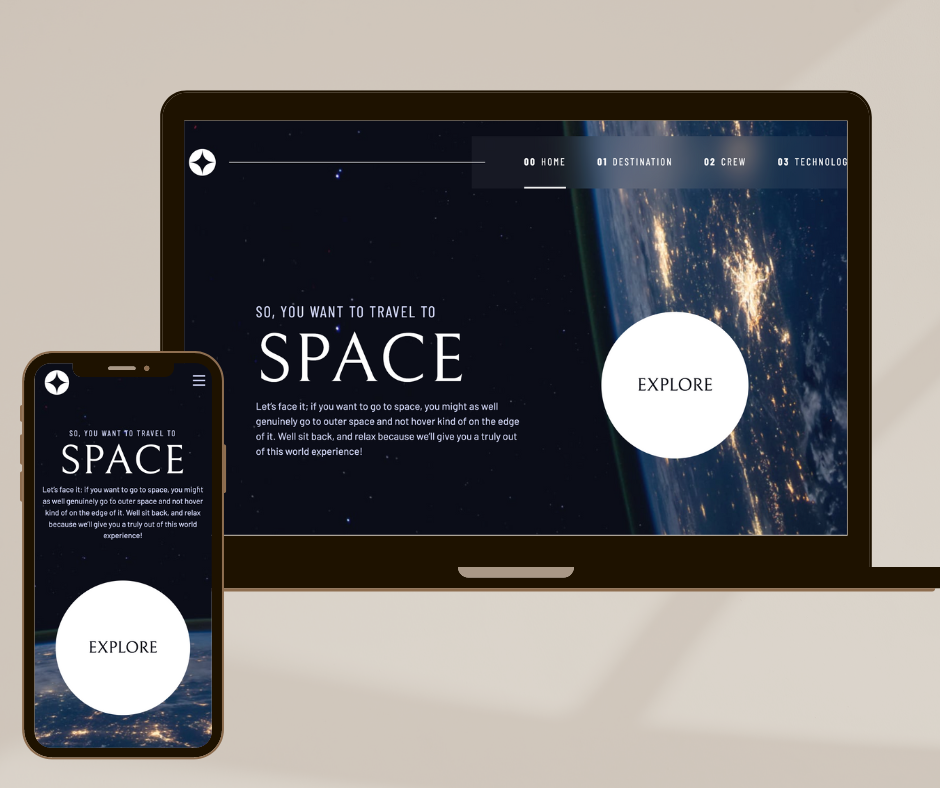
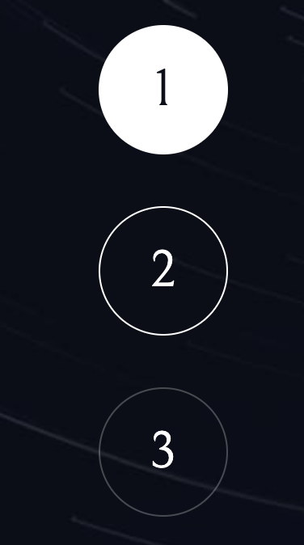

#### Frontend Mentor
This is a solution to the Space tourism website challenge on Frontend Mentor.

## Table of contents

- [Overview](#overview)
  - [The challenge](#the-challenge)
  - [Screenshot](#screenshot)
  - [Links](#links)
- [My process](#my-process)
  - [Built with](#built-with)
  - [What I learned](#what-i-learned)
  - [Continued development](#continued-development)
- [Author](#author)
- [Acknowledgments](#acknowledgments)

## Overview

### The challenge

Users should be able to:

- View the optimal layout for each of the website's pages depending on their device's screen size
- See hover states for all interactive elements on the page
- View each page and be able to toggle between the tabs to see new information

### Screenshot



### Links

- Solution URL: [Solution](https://github.com/earthlydev/Space-Tourism-Website/)
- Live Site URL: [Add live site URL here](https://your-live-site-url.com)

## My process

### Built with

- Semantic HTML5 markup
- CSS custom properties
- CSS custom utility classes
- Web Accessibility best practices
- Flexbox
- CSS Grid
- Mobile-first workflow
- JavaScript

### What I learned

In this project, I gained experience in building a website using vanilla CSS, HTML, and JavaScript.

CSS: I also utilized CSS utility classes and custom properties to improve the maintainability and scalability of my CSS. I also learned more about web accessibility and how to implement it in my website.

JS: I also used javascript to add interactivity to the website, which improved the user experience.

Summary: Some of the key takeaways from this project include understanding the basics of front-end web development, the importance of keeping the code clean and organized, the use of CSS utility classes and custom properties, and the importance of web accessibility. Overall, this project was a great opportunity for me to improve my skills and knowledge in front-end web development.

This code below allowed me to create an interactive element a part of my web design.

```css
.num-indicator > * {
  cursor: pointer;
  background: none;
  color: hsl(var(--clr-white));
  border: 1px solid hsl(var(--clr-white) / 0.25);
  border-radius: 50%;
  width: 2.5rem;
  aspect-ratio: 1;
  font-family: var(--ff-serif);
  font-size: var(--fs-600);
}
```



### Continued development

In future projects, I plan to continue focusing on integrating data into my websites using React and JSON files. This will allow me to create dynamic and interactive user experiences while also improving my skills in these technologies.

## Author

- Website - [Divine](https://earthlydev.netlify.app/)
- LinkedIn - [JA](https://www.linkedin.com/in/earthlydev/)

## Acknowledgments

Shout out to # Kevin Powell! 
Writing out beautiful CSS is an art and making it web accessible is amazing, thank you for the lesson.
